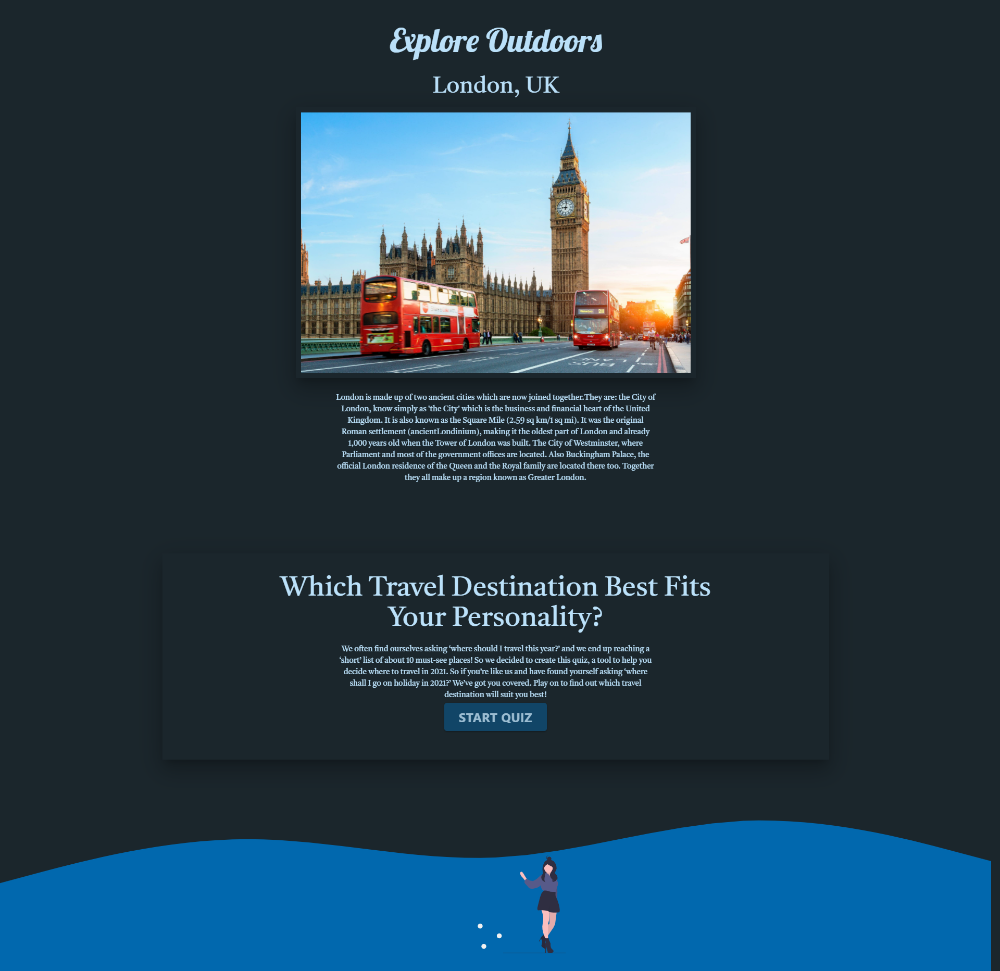

# Explore Outdoors

## Table of Contents:

- [Overview](#overview)
- [Purpose](#purpose)
- [Features](#features)
- [Website](#website)
- [Contributions](#contributions)

## Overview

Explore Outdoors is your one stop website to find the perfect destination for your next vacation when you can't decide where to go. Take our 12 question test and find the perfect destination based on six beautiful places we hand picked for you!

## Purpose

- This website will take a survey of the user and ask them about their interests. Based on the users interests, the user will be directed to a results page showing their chosen destination.

## Features

- HTML
- CSS
- JavaScript
- Animations
- RESTful API
- Materialize
- Mobile Friendly

## Website

[Deployed Explore Outdoors](https://ajcuddeback.github.io/Explore-Outdoors)

## Contributions

- [Irina Skitayeva](https://github.com/Irina256) (HTML/Content Creation)
  - [Irina's Portfolio](https://irina256.github.io/portfolio/)
- [Jephte Borno](https://github.com/jephtebb) (JavaScript/API's)
  - [Jephte's Portfolio](https://jephtebb.github.io/Portfolio/)
- [Jasmine Akbari](https://github.com/jasmineakbari) (CSS/Materialize)
  - [Jasmine's Portfolio](https://jasmineakbari.github.io/JA-Portfolio/)
- [Austin Cuddeback](https://github.com/ajcuddeback) (Animations/UI/UX)
  - [Austin's Portfolio](https://ajcuddeback.github.io)
